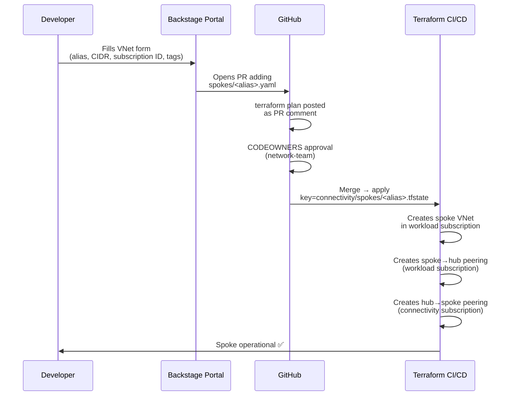

# Stage 3 — Spoke VNet Vending

> **Depends on:** Stage 0 (bootstrap), Stage 3/hub (hub VNet must be applied first).
> Provisions a spoke VNet in a workload subscription and wires both sides of the VNet peering
> to the platform hub. One `terraform apply` = one spoke = one isolated state file.

## How it works



## What it creates

| Resource | Name pattern | Subscription | Purpose |
| --- | --- | --- | --- |
| Resource Group | `rg-<spoke_name>-network` | Workload | Holds the spoke VNet |
| Spoke VNet | `<spoke_name>` | Workload | Workload network |
| Peering spoke → hub | `peer-<spoke_name>-to-hub` | Workload | Outbound path to hub |
| Peering hub → spoke | `peer-hub-to-<spoke_name>` | Connectivity | Inbound path from hub |
| DNS zone links | `link-<spoke_name>` (one per zone) | Connectivity | Optional — requires `private_dns_zone_link_enabled: true` in the YAML request and `private_dns_zones_enabled = true` in the hub stage |

## Cross-subscription provider design

The stage uses two `azurerm` provider instances to manage resources across subscriptions in a single apply:

```
azurerm (default)   → workload subscription  → spoke VNet, spoke→hub peering
azurerm.hub         → connectivity subscription → hub→spoke peering, DNS zone links
```

This is why the stage cannot use `for_each` over multiple spokes — Terraform does not support
dynamic provider alias assignment. Each spoke gets its own `terraform apply` and isolated state file.

## Request file format

Place a YAML file under `spokes/<alias>.yaml` (via a Backstage PR or manually):

```yaml
spoke_name:    "vnet-spoke-phoenix-dev"   # must be unique across all spokes
address_space: "10.1.0.0/16"             # must not overlap with hub (10.0.0.0/16) or other spokes

# Optional — defaults to var.default_location
# location: francecentral

# Optional — link spoke to hub private DNS zones
private_dns_zone_link_enabled: false

tags:
  application: project-phoenix
  environment: dev
  costCenter:  CC-1234
  owner:       dev@example.com
```

See [spokes/_example.yaml](spokes/_example.yaml) for a complete example.

## Prerequisites

1. **Stage `0-bootstrap` applied** — provides the remote backend.
2. **Stage `3/hub` applied** — hub VNet and its outputs must exist.
3. **Workload subscription provisioned** (via Stage 2 sub-vending or manually).
4. **Two sets of Azure credentials:**
   - `Owner` (or `Network Contributor`) on the **workload subscription** — default provider.
   - `Owner` (or `Network Contributor`) on the **connectivity subscription** — `azurerm.hub` provider.

   ```powershell
   az login
   az account set --subscription "<workload-subscription-id>"
   ```

## Activate the remote backend

In [terraform.tf](terraform.tf), uncomment and fill in the backend block, replacing `<alias>` with the spoke alias:

```hcl
backend "azurerm" {
  resource_group_name  = "<output: resource_group_name from stage 0>"
  storage_account_name = "<output: storage_account_name from stage 0>"
  container_name       = "cntnr-tfstate"
  key                  = "connectivity/spokes/<alias>.terraform.tfstate"
}
```

```powershell
terraform init -reconfigure
```

## Usage

```powershell
cd terraform/stages/3-connectivity/spoke-vending

# 1. Add the spoke YAML request under spokes/ (or let Backstage open the PR)
cp spokes/_example.yaml spokes/phoenix-dev.yaml
#    Edit spoke_name, address_space, workload_subscription_id, tags

# 2. Copy and fill in the variables
cp terraform.tfvars.example terraform.tfvars
#    Set spoke_file, workload_subscription_id, and hub references

# 3. Init with the spoke-specific backend key
terraform init

# 4. Review
terraform plan -out=tfplan

# 5. Apply
terraform apply tfplan
```

## Inputs from hub outputs

The following variables must be sourced from the hub stage outputs
(`terraform output -json` in `3-connectivity/hub`):

| Variable | Hub output | Description |
| --- | --- | --- |
| `hub_subscription_id` | `hub_subscription_id` | Connectivity subscription ID |
| `hub_vnet_id` | `hub_vnet_id` | Resource ID of the hub VNet |
| `hub_vnet_name` | `hub_vnet_name` | Name of the hub VNet |
| `hub_resource_group_name` | `resource_group_name` | Connectivity resource group |
| `private_dns_zone_ids` | `private_dns_zone_ids` | Required only when DNS linking is enabled |

## Outputs

| Output | Description |
| --- | --- |
| `spoke_vnet_id` | Resource ID of the spoke VNet |
| `spoke_vnet_name` | Name of the spoke VNet |
| `spoke_resource_group_name` | Resource group of the spoke VNet |
| `peering_spoke_to_hub_id` | Resource ID of the spoke→hub peering |
| `peering_hub_to_spoke_id` | Resource ID of the hub→spoke peering |

## CIDR planning

Each spoke must use a non-overlapping address space. Reserve ranges in advance:

| Spoke | CIDR |
| --- | --- |
| Hub | `10.0.0.0/16` |
| Spoke 1 (first workload) | `10.1.0.0/16` |
| Spoke 2 | `10.2.0.0/16` |
| *(pattern continues)* | `10.N.0.0/16` |

## Destroy

```powershell
terraform plan -destroy -out=tfplan-destroy
terraform apply tfplan-destroy
```

Both peerings are destroyed before the spoke VNet, which is before the resource group.
DNS zone links (if any) are destroyed in the connectivity subscription via `azurerm.hub`.
